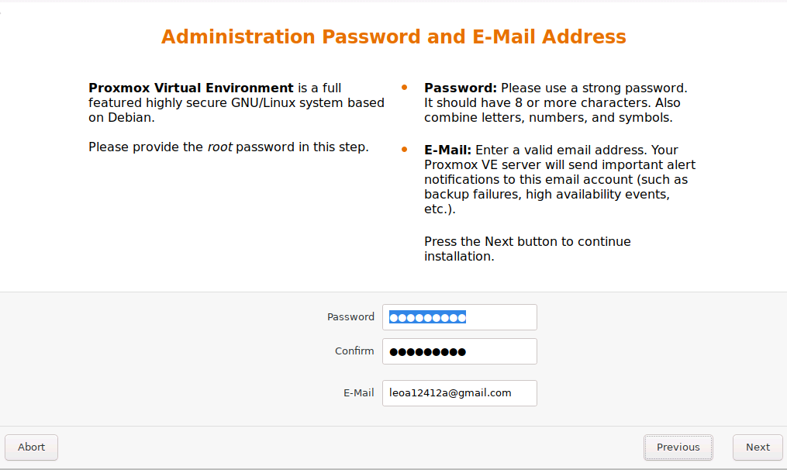
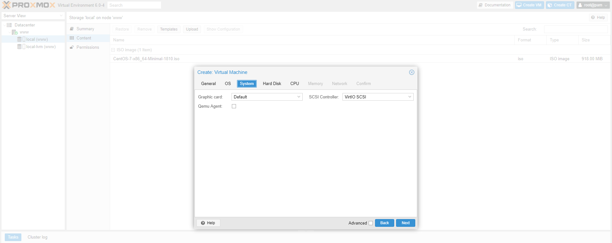

# Proxmox

Proxmox VE（英語：Proxmox Virtual Environment，通常簡稱為Proxmox），是一個開源的伺服器虛擬化環境Linux發行版。基於Debian，使用基於Ubuntu的客製化核心

## 安裝前

在實體機器上有兩個安裝方法
- USB
- 光碟

### USB
使用USB製作開機光碟需要使用製作開機USB的程式，這裡我使用<a href="https://rufus.ie/">Rufus</a>來製作，製作過程中請選擇以DD映像模式寫入
</br>
</br>

## 開始安裝

</br>

選擇地區"台灣"打一兩個字就有選項給你選
</br>
</br>
</br>
</br>

## 初次登入

帳號預設為root，根據提示我們可以去IP:8006查看web GUI
</br>

## 剛安裝完成 Proxmox 後，務必要立即做系統的安全性更新。

1.安裝vim，因為預設得vi輸入方式非常不好用，要先update再安裝，不然會有錯誤

```
apt-get update
apt-get install vim
```


2.變更 ipv4和ipv6 的優先順序為 ipv4 優先(速度會較快)<br>
某些更新站台或政府網站會同時回應 ipv4和ipv6，但ipv6卻無法正常回應，這時在預設以 ipv6 為優先的情況下會造成連不上或系統無回應.而遇到ipv6無回應的情況下會等待約21秒的時間才會切換回 ipv4，而造成等待的困擾.
<br>
關閉ipv6/只使用ipv4<br>
先修改 /etc/gai.conf<br>
```
vi /etc/gai.conf
```
<br>
找到
#precedence ::ffff:0:0/96  100<br>
這一行，將前面的 # 刪除並存檔(立即生效)<br>
precedence ::ffff:0:0/96  100<br>

<br>
3.將預設認購套件庫取消(官方只是希望使用者能付費來提供遠端的維護)<br>

```
vi /etc/apt/sources.list
```

<br>
加上這一行並存檔 (6.0-1 版 生效)<br>

```
deb http://download.proxmox.com/debian jessie pve-no-subscription
```

<br>
再執行更新<br>

```
apt-get update
apt-get dist-upgrade -y --force-yes
```

<br>
更新後會將 Proxmox VE 更新至官方目前的最新套件版本

## GUI

以下為GUI畫面，登入時可以選擇語言，翻譯還算滿完整的
</br>

local裡面有upload可以供上傳ISO檔等資料
</br>
</br>

# 

上傳完就可以建立虛擬機 VM ID是虛擬機的編號，從100開始，Name為虛擬機的名稱
</br>
</br>

Graphic card可以選擇虛擬機顯卡類型
</br>

Bus/Device可以選擇SATA等硬碟類型
</br>

Sockets:CPU數量，Cores:核心數
</br>
</br>
</br>

確認所有配置
</br>

## 使用虛擬機

安裝好虛擬機會再介面左手邊的位置，點下去跑出該虛擬機的效能監控，基本設定，防火牆設定...等資訊
</br>
console點開就是我們虛擬機的畫面，點左側按鈕可以開始、關閉、暫停...等，也可以放大到全螢幕。
</br>

## 巢狀虛擬機 Proxmox on Hype-v

如果想在hype-v下安裝proxmox可能會遇到proxmox裡虛擬化技術位開啟的問題，win server2016以上版本可以在power shell內開啟巢狀虛擬化技術，因為使用的機器為win2008，所以這裡就沒有實作跟確認是否可以執行。能確定的是2008無法使用這個指令。
```
Set-VMProcessor -VMName <VMName> -ExposeVirtualizationExtensions $true
```
參考網址:https://docs.microsoft.com/zh-tw/virtualization/hyper-v-on-windows/user-guide/nested-virtualization

## 叢級管理全部主機

將多台的 Proxmox Server 集合起來，可以在任何一台 Proxmox Server 上進行管理工作。
二台 Proxmox Server 的 VMID 不能一樣

假設這邊有兩台主機
1. A主機(主)
2. B主機(副)

### 步驟一 建立叢集

開啟網頁的終端機shell

</br>

A主機建立叢集
```
pvecm create pvecluster   // pvecluster為叢集名稱
```

### 步驟二 將B機的設定檔移至它處 

```
mkdir -p /root/pve/{lxc,qemu-server} 
mv /etc/pve/lxc/* /root/pve/lxc 
mv /etc/pve/qemu-server/* /root/pve/qemu-server 
reboot 
```

### 步驟三 將B機加入A機的叢集

```
pvecm add 192.168.131.226 
```

沒有第二步驟會有錯誤，無法加入

### 步驟四 將B主機上設定擋再移回來

```
mv /root/pve/lxc/* /etc/pve/lxc 
mv /root/pve/qemu-server/* /etc/pve/qemu-server 
rm -rf /root/pve 
reboot 
```

### 兩台機器皆可皆可進行管理

</br>

